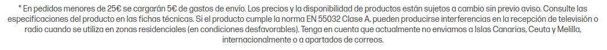
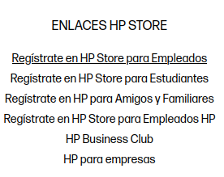
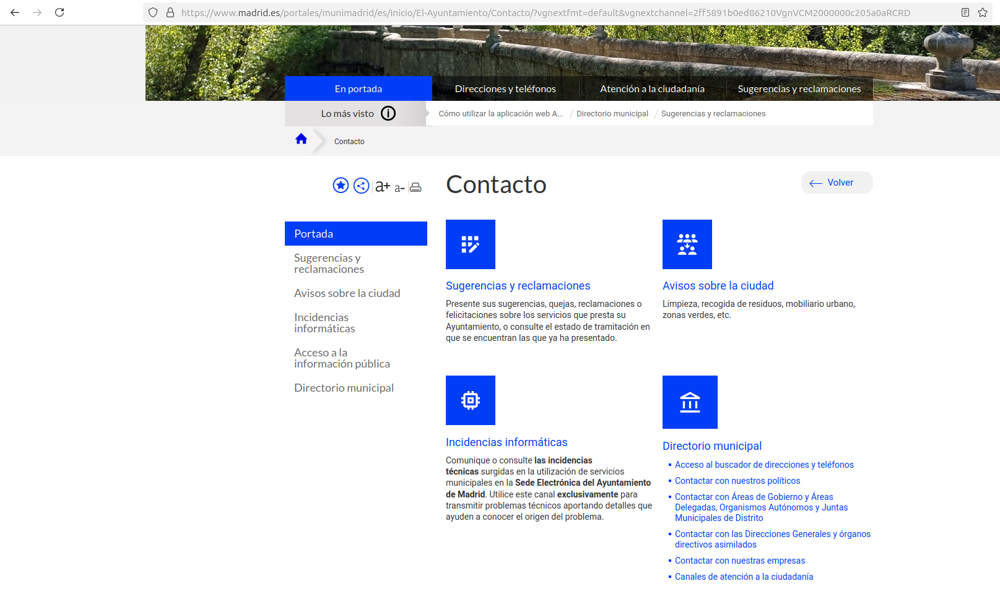
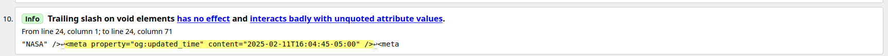
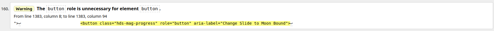
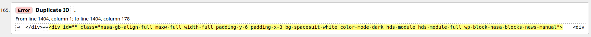

Javier Blázquez Ramírez
jblzqzr

# Práctica 1-2 - Incosistencias en el web
En este apartado, se dejan algunas paginas webs que han sido encontradas con ciertas inconsistencias en el uso del _tú_ y del _usted_.
En HP.es, encontramos una inconsistencia:

Pero también usa el término _tú_:

También se ha encontrado en la página oficial del [Ayuntamiento de Madrid](https://madrid.es).

Aquí vemos el uso de _usted_. Se aprecia: "_presente sus sugerencias_"

Aquí vemos el uso de _tú_. Se lee: "_tu contenido_, _tus trámites_".

# Práctica 1.3 - W3C Validator
## NASA
Para esta primera página, analizaremos la página de la [NASA](https://www.nasa.gov/). La NASA, _National Aeronautics and Space Administration_, es la agencia espacial estadounidense, con un presupuesto en 2020 de mas de 20 mil millones de dólares.
Podemos presuponer que su página web estará libre de errores, pero si lo analizamos desde la herramienta del W3C, _World Wibe Web Consortium_, pero vemos que eso no es así.

Para la página de la NASA, el validador nos destaca 265 alertas, separadas entre alertas de información, _warnings_ y errores como tal.

Veamos una alerta de información, el cuál es el más común:

Esto ocurre porque, los elementos de tipo void no tienen etiquieta de cierra, pero los desarrolladores, incluyen un _trailing slash_, "/" para cerrar el elemento. Aunque el navegador lo soporta, no es una buena práctica en HTML5, pues puede generar errores.

Un _warning_ que genera esta página, es uno de este estilo:

Este warning no genera ningún error en la página web, pero podría llegar a generarlo.

Un _error_ tiene esta forma:

Este error ha sido generado, porque hay más de un elemento con los mismos identificadores, que deben ser únicos.

# Práctica 1.4 - Elementos HTML
Usaremos dos navegadores para probar como funciona el _target blank_.
- Con Google Chrome, si pulsamos para abrir un enlace con el target blank, sí se abrirá en una nueva pestaña, dentro del mismo navegador.
- Con Firefox, ocurre de la misma manera, se abre en una nueva pestaña.

Pasando el código html por el Validador de W3C, se comprueba que no tiene errores ni warnings.

