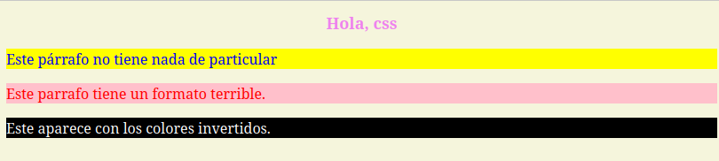
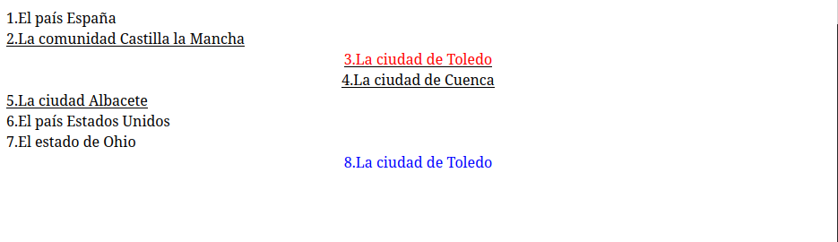

Javier Blázquez Ramírez
jblzqzr

# Práctica 2
## Práctica 2.1 - Análisis de selectores

### Ejemplo 1

El primer ejemplo, tiene esta forma:


Analizemos porque tiene esta pinta, analizando los estilos CSS.
- El primer estilo que encontramos es `* {background-color: beige}`, lo que aplica el estilo a todo el documento, generando que el documento entero tenga como fondo el color _beige_.

- El título _"Hola, css"_ es un elemento h1. A este elemento le aplican los estilos ` h1 { color: violet; text-align: center; font-size: large; }`. El selector hace que este este estilo afecte a **todos** los elementos que sean del tipo _h1_. En este caso, los _h1_ tendrán color violeta, estará alineado al centro y su tamaño de letra será grande.

- Ahora tenemos tres lineas, las cual podemos separar en tres tipos:
    - Un parrafo, que no pertenece a ninguna clase ni tiene un identificador.
    - Un parrafo de la clase _feo_.
    - Un elemento div de clase _inverso_ con un parrafo dentro de él.

Al primer párrafo, que no pertenece a ninguna clase y no tiene identificador, solo le afecta el estilo que afecta a los párrafos:
```css
p {
      color: blue;
      text-align: left;
      background-color: yellow;
    }
```

Tendremos por tanto, un párrafo de color azul, con el texto alineado a la izquierda y y color de fondo amarillo.

Para el resto de párrafos también le afectará estos estilos, a no ser que haya estilos más restrictivos que afecten a estos.

Esto ocurre en los otros dos párrafos. En el párrafo con texto, _'Este parrafo tiene un formato terrible'_, le afectará los estilos vistos antes, pero también le afectan los estilos aplicados a su clase, que son más restrictivos que la regla general.

Este párrafo, tendrá las reglas de la clase _feo_ pero además, los estilos de la regla general que no se superpongan, por ello, el párrafo tendrá el color rojo, con fondo rosa y alineado a la izquierda. Los estilos que le afectan son:

```css
p {
      color: blue;
      text-align: left;
      background-color: yellow;
    }

    .feo {
      color: red;
      background-color: pink;
    }
```

Pero de ellos, lo que realmente aplica quedaría:
```css
.feo {
      color: red;
      background-color: pink;

      text-align: left;
    }
```
Por ser algunos la superposición de otros.

Para la última linea, que está dentro de un elemento _div_, ya no solo le afectarán los estilos de los párrafos, sino también los que estén pensados para estos elementos _div_. En este caso, no hay reglas que apliquen a los elementos _div_.

Para este caso, el estilo que afecta son los del párrafo y los estilos con regla para la clase _inverso_, pues este elemento es progenitor del elemento párrafo del texto. En este caso, los estilos que aplican son los siguientes:
```css
p {
      color: blue;
      text-align: left;
      background-color: yellow;
    }

    .inverso {
      color: white;
      background-color: black;
    }
```

En este caso, tendremos un texto de color blanco, con fondo negro y alineado a la izquierda. Quedando los estilos que realmente aplican así:

```css
    .inverso {
      color: white;
      background-color: black;
      text-align: left;
    }
```

### Ejemplo 2

Tenemos el siguiente código:

```html
<!DOCTYPE html>
<html lang="es-ES">

<head>
  <meta charset="utf-8">
  <title> ej003 selectores 2</title>
  <style>
    .españa .toledo {
      color: red;
    }

    .toledo {
      color: blue;
    }

    .toledo, .cuenca {
      text-align: center;
    }

    .castilla-la-mancha {
      text-decoration: underline;
    }
  </style>
</head>

<body>
  <div class="país españa">
    1.El país España
    <div class="castilla-la-mancha">
      2.La comunidad Castilla la Mancha
      <div class="toledo">
        3.La ciudad de Toledo
      </div>
      <div class="cuenca">
        4.La ciudad de Cuenca
      </div>
      <div class="albacete">
        5.La ciudad Albacete
      </div>
    </div>
  </div>
  <div class="país estados-unidos">
    6.El país Estados Unidos
    <div class="ohio">
      7.El estado de Ohio
      <div class="toledo">
        8.La ciudad de Toledo
      </div>
    </div>
  </div>
</body>

</html>

```

Tenemos un código con dos elementos _div_ que dentro de ellos tienen otros elementos _div_, como descendientes.

Con los estilos, podemos predecir cual será el resultado:

```css
.españa .toledo {
      color: red;
    }
```
Afecta a las clases _toledo_ que sean descendientes de la clase _españa_. Esto aplicará al elemento que mostrará `3. La ciudad de Toledo`, que se mostrará en color rojo.

La siguiente regla:
```css
.toledo {
      color: blue;
    }
```

Hace que todas las clases _toledo_ se vean de color azul. Esto no afecta a nuestra clase anterior, pues como la anterior es más restrictiva o específica aplica esa regla.

Sin embargo, esto si afectará a la clase _toledo_ dentro de la clase _país estados-unidos_ con el texto `8. La ciudad de Toledo`. La cual se mostrará de color azul.

La siguiente regla:

```css
    .toledo, .cuenca {
      text-align: center;
    }
```

Esta regla afecta todas las clases que sean _toledo_ o _cuenca_. 

Estas clases estarán alineadas en el centro. ESto afecta a los textos:

- `3. La ciudad de Toledo`

- `4. La ciudad de Cuenca`

- `8. La ciudad de Toledo`

Por último, la última regla:

```css
.castilla-la-mancha {
      text-decoration: underline;
    }
```
Todas las clases _castilla-la-manha_ y sus descendientes estarán subrayados. Por tanto, afecta a:

- `2. La comunidad Castilla la Mancha`

- `3. La ciudad de Toledo`

- `4. La ciudad de Cuenca`

- `5. La ciudad de Albacete`

Con todas estas reglas, al final queda este resultado:


