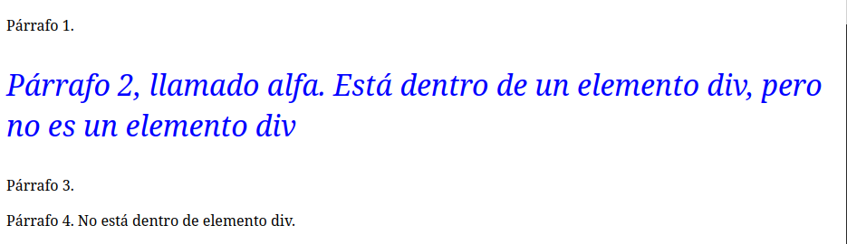
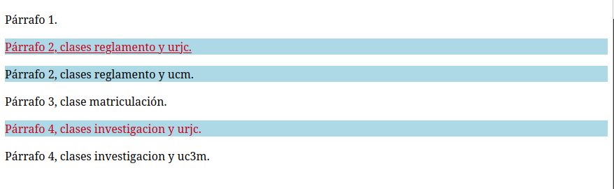

Javier Blázquez Ramírez jblzqzr

# Práctica 2

## Práctica 2.1 - Análisis de selectores

### Ejemplo 1

El primer ejemplo, tiene esta forma:


Analizemos porque tiene esta pinta, analizando los estilos CSS.

- El primer estilo que encontramos es
  `* {background-color: beige}`, lo que aplica el estilo a todo
  el documento, generando que el documento entero tenga como
  fondo el color *beige*.

- El título *"Hola, css"* es un elemento h1. A este elemento le
  aplican los estilos
  ` h1 { color: violet; text-align: center; font-size: large; }`.
  El selector hace que este este estilo afecte a **todos** los
  elementos que sean del tipo *h1*. En este caso, los *h1*
  tendrán color violeta, estará alineado al centro y su tamaño de
  letra será grande.

- Ahora tenemos tres lineas, las cual podemos separar en tres
  tipos:

  - Un parrafo, que no pertenece a ninguna clase ni tiene un
    identificador.
  - Un parrafo de la clase *feo*.
  - Un elemento div de clase *inverso* con un parrafo dentro de
    él.

Al primer párrafo, que no pertenece a ninguna clase y no tiene
identificador, solo le afecta el estilo que afecta a los
párrafos:

``` css
p {
      color: blue;
      text-align: left;
      background-color: yellow;
    }
```

Tendremos por tanto, un párrafo de color azul, con el texto
alineado a la izquierda y y color de fondo amarillo.

Para el resto de párrafos también le afectará estos estilos, a no
ser que haya estilos más restrictivos que afecten a estos.

Esto ocurre en los otros dos párrafos. En el párrafo con texto,
*'Este parrafo tiene un formato terrible'*, le afectará los
estilos vistos antes, pero también le afectan los estilos
aplicados a su clase, que son más restrictivos que la regla
general.

Este párrafo, tendrá las reglas de la clase *feo* pero además,
los estilos de la regla general que no se superpongan, por ello,
el párrafo tendrá el color rojo, con fondo rosa y alineado a la
izquierda. Los estilos que le afectan son:

``` css
p {
      color: blue;
      text-align: left;
      background-color: yellow;
    }

    .feo {
      color: red;
      background-color: pink;
    }
```

Pero de ellos, lo que realmente aplica quedaría:

``` css
.feo {
      color: red;
      background-color: pink;

      text-align: left;
    }
```

Por ser algunos la superposición de otros.

Para la última linea, que está dentro de un elemento *div*, ya no
solo le afectarán los estilos de los párrafos, sino también los
que estén pensados para estos elementos *div*. En este caso, no
hay reglas que apliquen a los elementos *div*.

Para este caso, el estilo que afecta son los del párrafo y los
estilos con regla para la clase *inverso*, pues este elemento es
progenitor del elemento párrafo del texto. En este caso, los
estilos que aplican son los siguientes:

``` css
p {
      color: blue;
      text-align: left;
      background-color: yellow;
    }

    .inverso {
      color: white;
      background-color: black;
    }
```

En este caso, tendremos un texto de color blanco, con fondo negro
y alineado a la izquierda. Quedando los estilos que realmente
aplican así:

``` css
    .inverso {
      color: white;
      background-color: black;
      text-align: left;
    }
```

### Ejemplo 2

Tenemos el siguiente código:

``` html
<!DOCTYPE html>
<html lang="es-ES">

<head>
  <meta charset="utf-8">
  <title> ej003 selectores 2</title>
  <style>
    .españa .toledo {
      color: red;
    }

    .toledo {
      color: blue;
    }

    .toledo, .cuenca {
      text-align: center;
    }

    .castilla-la-mancha {
      text-decoration: underline;
    }
  </style>
</head>

<body>
  <div class="país españa">
    1.El país España
    <div class="castilla-la-mancha">
      2.La comunidad Castilla la Mancha
      <div class="toledo">
        3.La ciudad de Toledo
      </div>
      <div class="cuenca">
        4.La ciudad de Cuenca
      </div>
      <div class="albacete">
        5.La ciudad Albacete
      </div>
    </div>
  </div>
  <div class="país estados-unidos">
    6.El país Estados Unidos
    <div class="ohio">
      7.El estado de Ohio
      <div class="toledo">
        8.La ciudad de Toledo
      </div>
    </div>
  </div>
</body>

</html>
```

Tenemos un código con dos elementos *div* que dentro de ellos
tienen otros elementos *div*, como descendientes.

Con los estilos, podemos predecir cual será el resultado:

``` css
.españa .toledo {
      color: red;
    }
```

Afecta a las clases *toledo* que sean descendientes de la clase
*españa*. Esto aplicará al elemento que mostrará
`3. La ciudad de Toledo`, que se mostrará en color rojo.

La siguiente regla:

``` css
.toledo {
      color: blue;
    }
```

Hace que todas las clases *toledo* se vean de color azul. Esto no
afecta a nuestra clase anterior, pues como la anterior es más
restrictiva o específica aplica esa regla.

Sin embargo, esto si afectará a la clase *toledo* dentro de la
clase *país estados-unidos* con el texto
`8. La ciudad de Toledo`. La cual se mostrará de color azul.

La siguiente regla:

``` css
    .toledo, .cuenca {
      text-align: center;
    }
```

Esta regla afecta todas las clases que sean *toledo* o *cuenca*.

Estas clases estarán alineadas en el centro. ESto afecta a los
textos:

- `3. La ciudad de Toledo`

- `4. La ciudad de Cuenca`

- `8. La ciudad de Toledo`

Por último, la última regla:

``` css
.castilla-la-mancha {
      text-decoration: underline;
    }
```

Todas las clases *castilla-la-manha* y sus descendientes estarán
subrayados. Por tanto, afecta a:

- `2. La comunidad Castilla la Mancha`

- `3. La ciudad de Toledo`

- `4. La ciudad de Cuenca`

- `5. La ciudad de Albacete`

Con todas estas reglas, al final queda este resultado:


### Ejemplo 3

Tenemos el siguiente código HTML:

``` html
<!DOCTYPE html>
<html lang="es-ES">

<head>
  <meta charset="utf-8">
  <title> ej004 selectores 3 </title>
  <style>
    #alfa {
      color: blue;
    }

    p#alfa {
      font-size: 200%;
    }

    div#alfa{
      background-color: yellow;
    }

    div #alfa{
      font-style: italic;
    }

  </style>
</head>

<body>
 <div>
  <p>Párrafo 1.</p>
  <p id="alfa">Párrafo 2, llamado alfa. Está dentro de un elemento div, pero no es un elemento div</p>
  <p>Párrafo 3.</p>
</div>

  <p>Párrafo 4. No está dentro de elemento div.</p>

</body>

</html>
```

Vamos a ir repasando los estilos a ver dónde aplica cada uno. El
primero de ellos:

``` css
    #alfa {
      color: blue;
    }
```

Aplica a todos los elementos cuyo identificador sea *alfa*. Como
es un identificador, este debe ser único, por tanto, solo debe
afectar a un solo elemento.

El parrafo con el identificador *alpha*, cuyo texto será azul,
tiene de texto : *Párrafo 2, llamado alfa. Está dentro de un
elemento div, pero no es un elemento div*.

La siguiente regla de estilos:

``` css
p#alfa {
      font-size: 200%;
    }
```

Esta regla afecta a todos los elementos parrafo que tengan como
identificador *alfa*. Este estilo solo afecta al mismo elemento
nombrado con anterioridad, cuyo texto *Párrafo 2, llamado alfa.
Está dentro de un elemento div, pero no es un elemento div* será
un 200% más grande.

El siguiente estilo:

``` css
div#alfa{
      background-color: yellow;
    }
```

Esto afectará a los elementos *div* que tengan como identificador
*alfa*. No afecta a ningún elemento en nuestro código. Pese a sí
tener un elemento div y un elemento con un identificador *alfa*
no le afecta, pues el elemento identificado como *alfa* no es un
*div* sino un párrafo.

El último estilo:

``` css
div #alfa{
      font-style: italic;
    }
```

Afectará a todas los elementos *div* o a todos los elementos con
identificador *alfa*. Esta regla sí aplica al elemento
identificado como *alfa*. Pues esta regla genera la posibilidad
de que siendo *div* **O** siendo *alfa* aplique esta regla.

Por tanto, el texto *Párrafo 2, llamado alfa. Está dentro de un
elemento div, pero no es un elemento div* estará en letra italica
o cursiva.

La página queda de la siguiente manera:



### Ejemplo 4

Tenemos este código:

``` html
<!DOCTYPE html>
<html lang="es-ES">

<head>
  <meta charset="utf-8">
  <title> ej005 selectores4 </title>
  <style>
    .urjc {
      color: #CB0017;
    }

    .urjc.reglamento {
      text-decoration: underline;
    }

    .urjc, .reglamento {
      background-color: lightblue;
    }
  </style>
</head>

<body>
  <p>Párrafo 1.</p>
  <p class="reglamento urjc">Párrafo 2, clases reglamento y urjc.</p>
  <p class="reglamento ucm">Párrafo 2, clases reglamento y ucm.</p>
  <p class="matriculacion">Párrafo 3, clase matriculación.</p>
  <p class="investigacion urjc">Párrafo 4, clases investigacion y urjc.</p>
  <p class="investigacion uc3m">Párrafo 4, clases investigacion y uc3m.</p>
</body>

</html>
```

Analizaremos uno a uno todos los estilos para ver como aplican.

Antes de esto, hay que recordar que a la hora de definir clases
en html, si separamos por espacio, estamos definiendo varios
valores de clase para un mismo elemento. Por ejemplo, en este
elemento:

``` html
<p class="reglamento urjc">Párrafo 2, clases reglamento y urjc.</p>
```

Este elemento pertenece a la clase *reglamento* y a la clase
*urjc*.

Con esto claro, vamos con el primer estilo.

``` css
.urjc {
      color: #CB0017;
    }
```

Todas las clases urjc tendrán este color. ESto afecta a los
parrafos con los siguientes textos:

- *Párrafo 2, clases reglamento y urjc.*

- *Párrafo 4, clases investigacion y urjc.*

El siguiente estilo:

``` css
.urjc.reglamento {
      text-decoration: underline;
    }
```

Afectará a todos los elementos que sean de clase *urjc* y clase
*reglamento*. Su texto estará subrayado, y solo aplica al
siguiente elemento: *Párrafo 2, clases reglamento y urjc.*.

El último estilo:

``` css
.urjc, .reglamento {
      background-color: lightblue;
    }
```

Esta regla afectará a todos los elementos que pertenezcan a la
clase *urjc* **O** a la clase *reglamento*, cuyo fondo será de
azul claro.

Los elementos afectados son los que tienen el siguiente texto:

- *Párrafo 2, clases reglamento y urjc.*

- *Párrafo 2, clases reglamento y ucm.*

- *Párrafo 4, clases investigacion y urjc.*

Con estas reglas, el resultado queda así:


